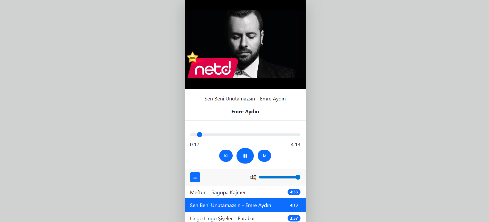
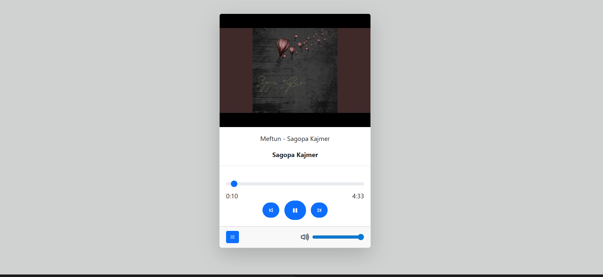

#  Music Player

## Teknolojiler

- **HTML5**
- **CSS3**
- **Bootstrap 5**
- **JavaScript (Vanilla)**

## Özellikler

🚀 Özellikler

Şarkı başlatma / durdurma

Sonraki / önceki şarkıya geçme

Ses kontrolü

Şarkı resmi, başlık ve sanatçı bilgisini gösterme

Toplam şarkı süresini ekranda gösterme

Progress bar (ilerleme çubuğu)


## 📸 Ekran Görüntüsü




## 📁 Kurulum

Projeyi kendi bilgisayarında çalıştırmak için:

1. Bu repoyu klonlayın:
   ```bash
   [git clone [https://github.com/barzandavut/.]
   ```

2. Tarayıcıda açmak için:
   ```bash
   index.html dosyasını çift tıklayın veya bir canlı sunucuda çalıştırın.
   ```

## 🧑‍💻 Geliştirici

**Davut Çiftçi**  
- [LinkedIn](https://www.linkedin.com/in/barzandavutciftci/) 
-  [GitHub](https://github.com/barzandavut)
